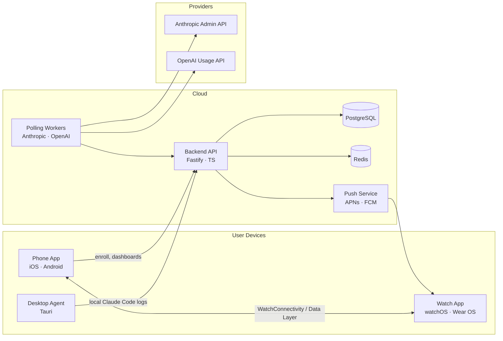

# Cap

> Real-time AI API usage on your wrist.

Cap monitors your **Anthropic Claude Code** and **OpenAI Codex** usage in real time and surfaces it as glanceable complications, tiles, and notifications across **Apple Watch**, **Galaxy Watch**, **iOS**, and **Android**.

Tap your wrist. See what's left. Don't get throttled mid-task.

---

## Why Cap

If you live in Claude Code Max or burn through Codex budget daily, you've felt it: hitting the 5-hour rolling limit mid-feature, mid-thought. Cap closes the visibility gap.

- **Watch-first** — complication on your face, tile on Galaxy. Glance, not unlock-tap-scroll.
- **Predictive** — "you'll hit Max limit in 32 min at this pace." Push before you're stuck.
- **Both providers, one view** — Anthropic Admin API + OpenAI Usage API + local Claude Code log parsing.
- **Privacy-first** — API keys encrypted on-device, only ciphertext leaves the phone. No prompt content, no code, ever.

---

## Architecture

```
[Desktop Agent] ──► [Backend API] ◄── [Phone App: iOS / Android]
 (log parsing,         (poll, cache,        (key vault, dashboards)
  incremental upload)   aggregate, push)
                              │
                              ▼
                      [APNs / FCM Push]
                              │
                              ▼
                  [Watch App: watchOS / Wear OS]
                  (complications, tiles, haptics)
```



---

## Repo layout

```
.
├── backend/          Fastify + TypeScript API, polling workers
├── shared-types/     TypeScript types shared by backend & bridges
├── ios/              SwiftUI phone app + watchOS target
├── android/          Compose phone app + Wear OS target
├── desktop-agent/    Tauri agent for local Claude Code / Codex logs
├── assets/           Brand assets, icons, fonts
├── docs/             Deploy guides, runbooks, API refs
├── tools/            Build & dev scripts
└── openapi.yaml      Source-of-truth API contract
```

---

## Tech stack

| Surface | Stack |
|---|---|
| Backend | Node 22, Fastify, TypeScript, PostgreSQL, Redis, BullMQ |
| iOS / watchOS | Swift 5.9, SwiftUI, WatchKit, WidgetKit (Complications) |
| Android / Wear OS | Kotlin, Jetpack Compose, Compose for Wear OS, Tiles API |
| Desktop agent | Rust, Tauri 2, WebView2 / WebKit |
| Infra | Docker, Fly.io / Railway, AWS KMS / GCP KMS |

---

## Status

| Milestone | Scope | Status |
|---|---|---|
| M1 | Backend scaffolding, polling workers, OpenAPI spec | ✅ done |
| M2 | iOS phone app: onboarding, key vault, dashboard | ✅ done |
| M3 | watchOS complications + WatchConnectivity sync | ✅ done |
| M4 | Android phone app + Wear OS tiles | ✅ done |
| M5 | Tauri desktop agent for local log streaming | ✅ done |
| M6 | APNs / FCM push, threshold evaluator, beta release | ✅ done |

Next: public TestFlight + Play Console internal testing → see [Launch Checklist](docs/LAUNCH.md).

---

## Quick start

### Backend

```bash
cd backend
cp .env.example .env
docker compose up -d postgres redis
pnpm install
pnpm migrate
pnpm dev
```

API serves on `http://localhost:8080`. OpenAPI spec lives at [`openapi.yaml`](./openapi.yaml) and is also served at `/openapi.yaml`.

### Phone apps

```bash
# iOS
cd ios && open Cap.xcworkspace

# Android
cd android && ./gradlew :app:installDebug
```

### Desktop agent

```bash
cd desktop-agent/src-tauri
cargo tauri dev
```

### Verify everything

```bash
pnpm install
pnpm --filter @cap-app/backend test     # 45 unit tests
pnpm --filter @cap-app/backend lint
bash assets/icon/render.sh              # regenerate app icons
```

---

## Security model

- **API keys never leave the phone in plaintext.** The phone generates a per-account data key, encrypts the provider key locally with libsodium secretbox, and uploads `(ciphertext, kid)` to the backend.
- **Backend stores only ciphertext** + the `kid` reference. The wrapping key lives in AWS KMS / GCP KMS in production (libsodium with `KEK_BASE64` for dev).
- **TLS 1.3 only.** The phone app pins the backend leaf certificate SHA-256.
- **No prompt content, no code, ever.** Polling workers consume only aggregated counters from provider Admin/Usage APIs.
- **Local logs stay local.** The desktop agent parses Claude Code logs in `~/.claude/projects/**/*.jsonl` and uploads only token counters and timestamps — never message content.
- **Zero Data Retention** option for Pro users — usage is aggregated, never stored at row level.

Full threat model: [docs/SECURITY.md](docs/SECURITY.md).

---

## Pricing

Three tiers: **Free** (1 service, phone-only), **Plus ₩2,900/월** (watch + 2 services + alerts), **Pro ₩6,900/월** (unlimited + desktop agent + predictive alerts). Team plan ₩9,900/seat/월.

Full pricing: [cap.app/pricing](https://cap.app/pricing) (or `cap-landing.html` in this repo for the design).

---

## Deployment

- **Backend**: Fly.io (`backend/fly.toml`) or Railway. Same Dockerfile.
- **iOS**: TestFlight → App Store
- **Android**: Play Console internal testing → production
- **Desktop agent**: notarized DMG (macOS) + signed MSIX (Windows) via Tauri's CI workflow

Step-by-step: [docs/DEPLOY.md](docs/DEPLOY.md).

---

## Contributing

This is currently a single-maintainer project in pre-launch. Issues and PRs welcome after public release. For now:

- Bug reports → GitHub Issues
- Feature requests → GitHub Discussions
- Security disclosures → security@cap.app (PGP key in `docs/SECURITY.md`)

---

## License

Source code: **MIT**. Brand assets (logo, icon, name "Cap") are proprietary — see [LICENSE-BRAND](LICENSE-BRAND).

---

<sub>Built with Claude Code. Designed in long evenings. © 2026 Cap.</sub>
