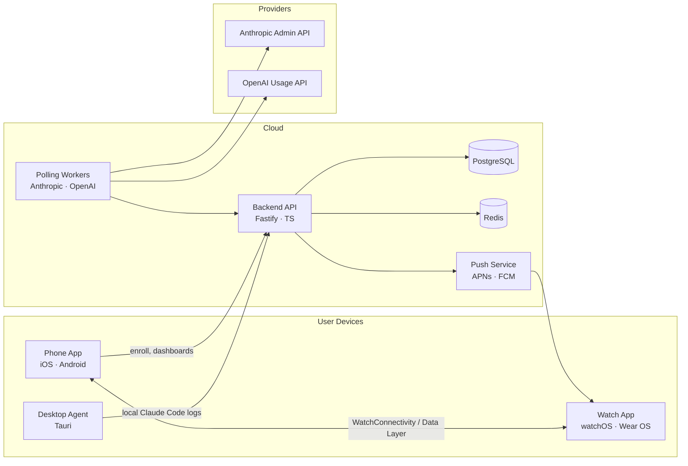

# PulseWatch — AI API Usage Monitor

Realtime Anthropic Claude Code & OpenAI Codex usage on your wrist.

```
[Desktop Agent] ──► [Backend API] ◄── [Phone App: iOS / Android]
 (log parsing,         (poll, cache,        (key mgmt, dashboards)
  incremental upload)   aggregate, push)
                              │
                              ▼
                      [APNs / FCM Push]
                              │
                              ▼
                  [Watch App: watchOS / Wear OS]
                  (complications, tiles, haptics)
```

## Architecture



## Repo layout

```
.
├── backend/          Fastify + TypeScript API, polling workers
├── shared-types/     TypeScript types shared by backend, desktop, phone bridges
├── ios/              SwiftUI phone app + watchOS target (M2/M3)
├── android/          Compose phone app + Wear OS target (M4)
├── desktop-agent/    Tauri agent for local Claude Code/Codex logs (M5)
└── openapi.yaml      Source-of-truth API contract
```

## Milestones

| ID | Scope                                               | Status |
|----|-----------------------------------------------------|--------|
| M1 | Backend scaffolding, polling workers, OpenAPI spec  | this PR |
| M2 | iOS phone app: onboarding, key vault, dashboard     | pending |
| M3 | watchOS complications + WatchConnectivity sync      | pending |
| M4 | Android phone app + Wear OS tiles                   | pending |
| M5 | Tauri desktop agent for local log streaming         | pending |
| M6 | APNs/FCM push, threshold prediction, beta release   | pending |

## Security model

- API keys never leave the phone in plaintext. The phone app generates a per-account
  data key, encrypts the provider key locally, and uploads `(ciphertext, kid)` to the
  backend. The backend stores only ciphertext and the `kid` reference.
- The backend holds a wrapping key in a KMS (AWS KMS or GCP KMS in prod, libsodium
  secretbox with a key from `KEK_BASE64` in dev) and never logs decrypted material.
- TLS 1.3 only; the phone app pins the backend leaf certificate SHA-256.
- Prompt content and code are never collected. The polling workers consume only
  aggregated counters from the provider Admin/Usage APIs.

## Quick start (backend, M1)

```bash
cd backend
cp .env.example .env
docker compose up -d postgres redis
pnpm install
pnpm migrate
pnpm dev
```

API serves on `http://localhost:8080`. OpenAPI spec lives at
[`openapi.yaml`](./openapi.yaml) and is also exposed at `/openapi.yaml`.

## Deployment

- Backend: Fly.io (`backend/fly.toml`) or Railway. Both ship the same Dockerfile.
- Phone apps: TestFlight (iOS) and Play Console internal testing (Android).
- Desktop agent: notarized DMG / signed MSIX produced by Tauri's CI workflow.
